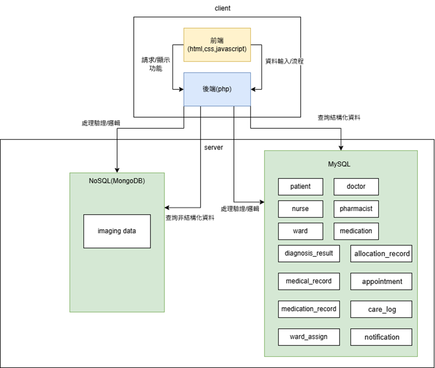

# Hospital Medical Record System - PoC (SQL + NoSQL)

本專案為醫院病歷管理系統（Hospital Medical Record System）的概念驗證成果  
展示 SQL（MySQL）與 NoSQL（MongoDB GridFS、Redis、Cassandra）在系統中的資料分工與查詢方式。

本 PoC 內容包含：

- SQL 資料表結構（schema.sql）
- SQL 查詢示例（sample_queries.sql）
- MongoDB GridFS 儲存檢驗圖片
- Redis Key-Value 快取示例
- Cassandra 分散式查詢示例
- NoSQL JSON 文件範例
- 系統架構圖與資料流流程
- 操作方式（如何執行查詢）

## 📁 專案目錄結構

```
hospital-poc/
│
├── sql/
│   ├── schema.sql               
│   └── sample_queries.sql       
│
├── nosql/
│   ├── mongo_queries.json       
│   ├── sample_documents.json    
│   ├── redis_commands.txt       
│   └── cassandra_queries.cql    
│
└── README.md
```

## 🧩 系統架構（SQL + NoSQL 分工）

下圖展示了本系統前端、後端、SQL、NoSQL 之間的資料流動與功能分工：




## 🗂 SQL（MySQL）用途

以下資料以 SQL 儲存：

- 病人資料（patient）
- 醫生、護士、藥師
- 預約（appointment）
- 病歷（medical_record）
- 診斷結果（diagnosis_result）
- 配藥（medication_record）
- 住院分配、護理紀錄、通知

## 🗂 NoSQL（MongoDB GridFS）用途

MongoDB 僅儲存檢驗圖片（exam_image_ids）

範例：

```json
{
  "_id": "6933fd06e5958e189309bc40",
  "filename": "w5izyne8cx0g1.jpeg",
  "metadata": {
    "record_id": "1",
    "content_type": "image/jpeg"
  }
}
```

## 🔍 SQL 查詢示例

```sql
SELECT mr.record_id, p.name, d.doctor_name
FROM medical_record mr
JOIN patient p ON mr.patient_id = p.patient_id
JOIN doctor d ON mr.doctor_id = d.doctor_id;
```

## 🔍 MongoDB 查詢示例

```json
{
  "find_images_by_record_id": {
    "collection": "fs.files",
    "query": { "metadata.record_id": "1" }
  }
}
```

## 🔍 Redis 示範

```
SET patient:1 "{ 'name': '王小明', 'phone': '0900123456' }"
GET patient:1
```

## 🔍 Cassandra 示範

```
SELECT * FROM medical_record_by_patient
WHERE patient_id = 1;
```

## 🧪 PoC 驗證流程

1. 匯入 schema.sql 建立資料庫  
2. 執行 sample_queries.sql 測試 CRUD + JOIN  
3. 上傳圖片至 MongoDB（GridFSBucket）  
4. 測試 mongo_queries.json 查詢影像  
5. 使用 Redis 測試快取  
6. 使用 Cassandra 示範分散式查詢  
7. 將查詢結果截圖放入書面報告  

## 📌 SQL 執行方式

```
mysql -u root -p < schema.sql
mysql -u root -p < sample_queries.sql
```

## 📌 MongoDB 查詢方式

```
db.fs.files.find({ "metadata.record_id": "1" })
```

## 📌 作者

本專案為雲科大資料庫系統期末專案 PoC。
